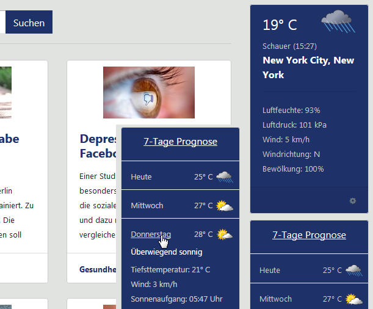
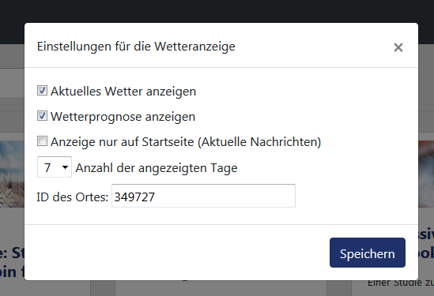

# derstandard.rss
Simples PHP Framework um die RSS Feeds von derstandard.at auf einer Website anzuzeigen

Für alle denen das neue derstandard.at Design nicht gefällt, hier ein simples Framework mit den Nachrichten aus den RSS Feeds.
- Eine Suchfunktion und ein Textmodus sind mit an Bord.
- Benötigt wird ein Webserver mit PHP 5 oder höher und eine SQL Datenbank.
- Um die Feeds regelmässig einzulesen, einfach einen Cron Job erstellen der die Datei rss.php im Ordner /parser aufruft.
- Die Datei sql-structure.sql beinhaltet den Dump für die Datenbank
- In der Datei config.php im Ordner /parser sind die Zugangsdaten für die Anbindung zur Datenbank einzutragen

Sobald der RSS Parser (parser/rss.php) erstmalig ausgeführt wurde, empfiehlt es sich die Schleife zu ändern um unnötige Durchläufe zu vermeiden.

```
for ($i = 0; $i <= $i; $i++)
```
ändern zu

```
for ($i = 0; $i <= 20; $i++)
```


Das Framework ist ausschließlich für den privaten Eigenbedarf gedacht, da eine Weiterverwendung und Reproduktion der Inhalte über den persönlichen Gebrauch hinaus nicht gestattet ist.

# Update vom 01.08.2019

Auflistung der Nachrichten nach Unterkategorie hinzugefügt

# Update vom 25.07.2019

Die Desktop Ansicht wird nun breiter dargestellt und auf der rechten Seite wurde ein Wettertab hinzugefügt.

Dort wird das aktuelle Wetter und die Prognose der nächsten Tage angezeigt.

verwendet dafür wird der XML Feed von accuweather.com.

Um das Wetter einer Stadt anzuzeigen, wird die jeweilige cityId benötigt.

Die bekommt man wie folgt raus:

1. Die Adresse https://www.accuweather.com/en/at/ im Browser aufrufen
2. In das Suchfeld den Ort eintragen
3. Den gewünschten Ort anklicken
4. In der Adressleiste des Browser die Zahl am Ende der Url rauskopieren ( zB. für Wien, Innere Stadt: https://www.accuweather.com/de/at/innere-stadt/951479/weather-forecast/951479 )
5. Die cityId lautet: 951479

Nun in der Anwendung am Ende des Wettertabs auf das 'Einstellungen Symbol' klicken.
Im Feld 'ID des Ortes' die Zahl eintragen, und danach speichern klicken.

Nach dem aktualisieren der Seite werden die Wetterinformationen des Ortes angezeigt.

Um die Daten regelmässig abzufragen ist es notwendig einen Cron Job zu erstellen der zB. alle 10 Minuten die Datei accuweather.php im Ordner /parser aufruft.


#







