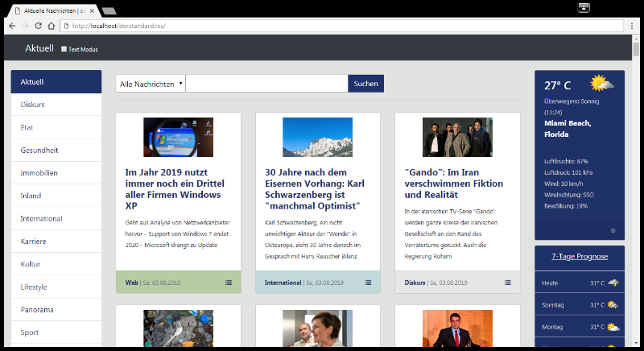
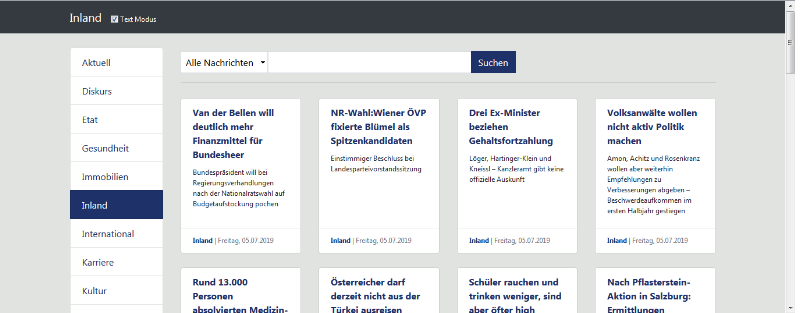
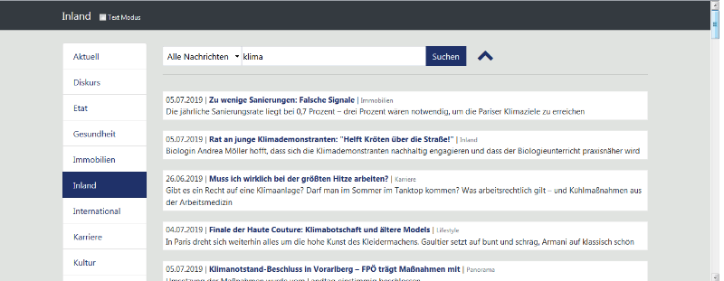

# derstandard.rss
Simples PHP Framework um die RSS Feeds von derstandard.at auf einer Website anzuzeigen

Für alle denen das neue derstandard.at Design nicht gefällt, hier ein simples Framework mit den Nachrichten aus den RSS Feeds.
- Eine Suchfunktion und ein Textmodus sind mit an Bord.
- Benötigt wird ein Webserver mit PHP 5 oder höher und eine SQL Datenbank.
- Um die Feeds regelmässig einzulesen, einfach einen Cron Job erstellen der die Datei rss.php im Ordner /parser aufruft.
- Die Datei sql-structure.sql beinhaltet den Dump für die Datenbank
- In den Dateien: index.php, search.php und rss.php sind die Zugangsdaten für die Anbindung zur Datenbank einzutragen

Das Framework ist ausschließlich für den privaten Eigenbedarf gedacht, da eine Weiterverwendung und Reproduktion der Inhalte über den persönlichen Gebrauch hinaus nicht gestattet ist.

